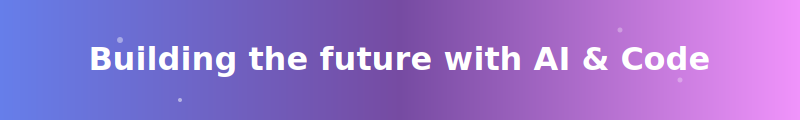

<!-- Animated header -->

  

<!-- Typing animation -->

  

<!-- Profile badges -->

  
  
  

## About Me

- Computer Science and Physics Undergraduate at **Penn State University**
- Multi-domain researcher leveraging AI to build the future
- Full-Stack Developer crafting web and mobile applications

### Current Focus

- AI/ML Research in Computer Vision and NLP
- Building scalable microservices architectures
- Cross-platform mobile development
- Contributing to open-source projects

## Tech Stack

### Languages

  
  
  
  
  
  

### Frontend & Mobile

  
  
  
  
  

### Backend & DevOps

  
  
  
  
  
  

## Activity

  

## Featured Projects

  
  

##

  <i>I'm always interested in collaborating on innovative projects and research opportunities!</i>

---

  

